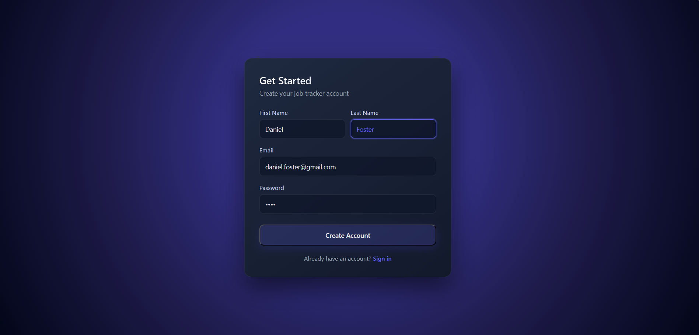
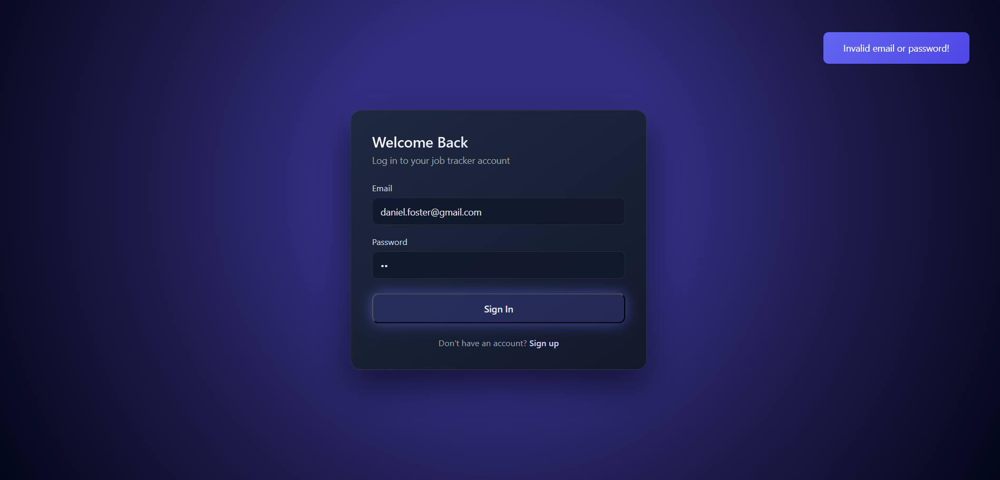
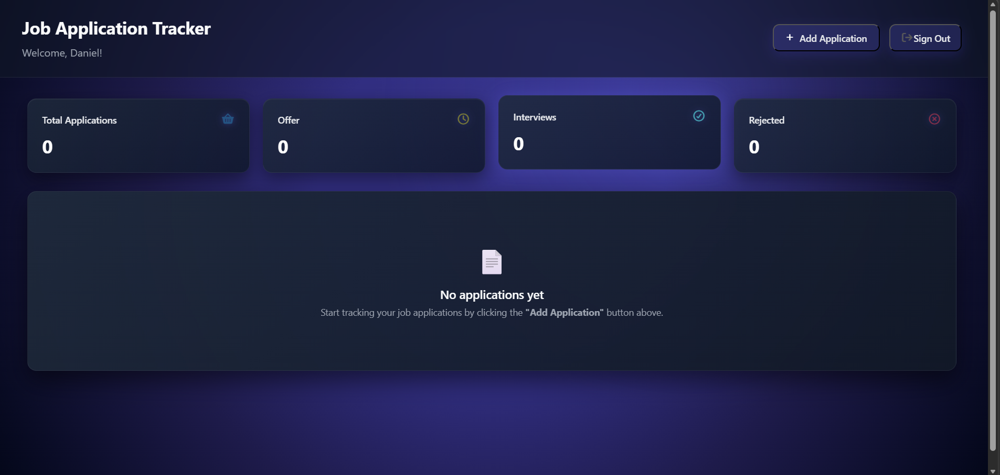
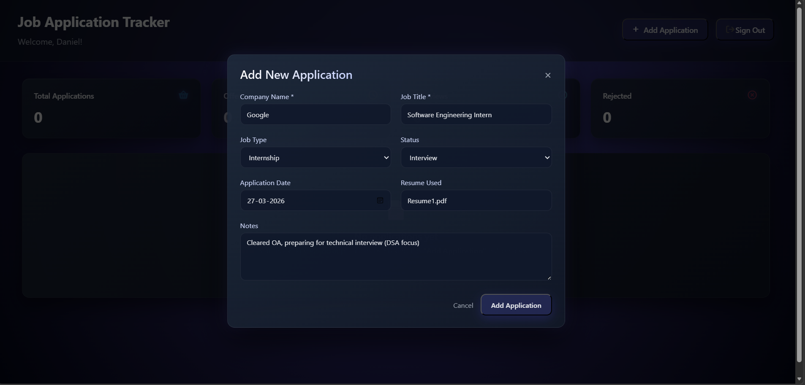
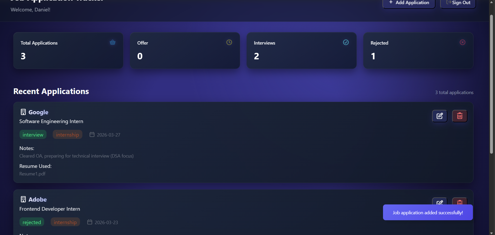
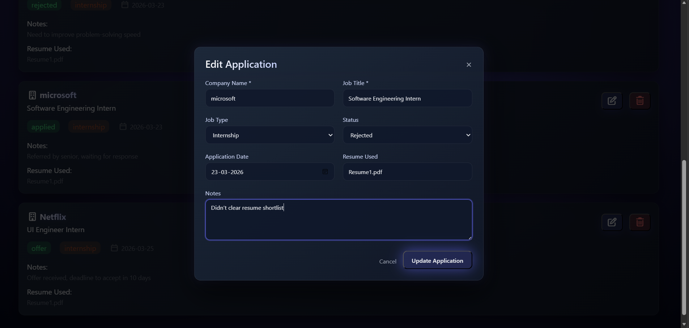

# 🚀 Job Application Tracker Dashboard

Take control of your job hunt with a system designed for clarity, speed, and consistency.

This isn’t just about tracking applications — it’s about managing your entire job search with structure and precision.

---

## 📸 Project Screenshots

### Signup and Login Page

  
  

### Dashboard and Add Application

  
  

### Dashboard Overview and Modify Application

  
  

---

## ✨ Overview

Most trackers feel cluttered and hard to maintain.

This one keeps things simple and focused:
* Clean interface with no distractions  
* Fast and responsive interactions  
* Designed for consistent, everyday use  

---

## 🔐 Seamless Authentication Experience

* Smooth **Sign Up / Sign In flow**
* Real-time **input validation**
* Smart **toast feedback system** for errors and actions
* Seamless switch between **Sign Up ↔ Sign In**
* Supports **multiple users with isolated data**
* Session persistence for uninterrupted usage

---

## 📊 Dashboard Insights

At a glance, instantly understand your progress:

* 🔢 **Total Applications**
* 🟢 **Offers**
* 🟡 **Interviews**
* 🔴 **Rejected**

All stats update **dynamically in real-time**, giving you immediate feedback as you take actions.

---

## 📌 Application Management

Easily manage every opportunity with structured data:

### ➕ Add Application

* Store complete job details including role, company, type, status, date, resume, and notes

### ✏️ Edit Application

* Modify entries seamlessly without breaking flow

### 🗑️ Delete Application

* Remove records instantly with responsive UI feedback

---

## 🔥 Smart Features

* 🔄 **Real-time updates** across UI and stats
* 🎯 **Consistent data flow** ensuring accuracy
* 🧩 Structured data handling for efficient record management
* 🔔 Context-aware **toast notifications** for better UX
* 🪄 Smooth **modal based workflows**
* 📭 Clean **empty state handling**
* 🔐 Reliable **form validation & error handling**

---

## 🎨 UI/UX & Design

Designed with attention to detail:

* 🌙 **Dark theme aesthetic**
* 💎 Glassmorphism-inspired cards
* ⚡ Smooth animations, hover effects & transitions
* 🎯 Clean spacing & typography
* 📱 Fully responsive across devices

Everything is built to feel **fast, intuitive, and satisfying**.
No clutter. No distractions. Just focus.

---

## Tech Stack
- HTML for structure
- CSS3 for styling and responsive design
- JavaScript for application logic and dynamic UI updates 

---

## ⚡ Final Note

Built to simplify job tracking with a clean interface and reliable interactions.

Focused on clarity, speed, and a smooth user experience — without unnecessary complexity.

---
